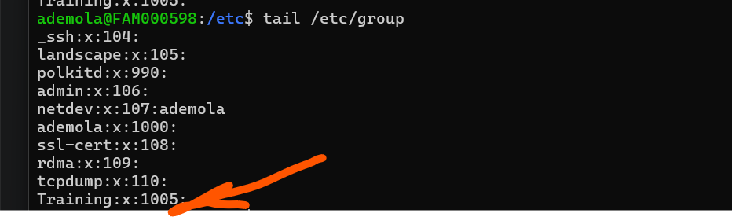
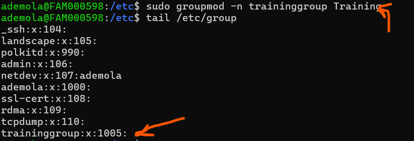

# Project Overview

This Project is going to help Understand Group management in Linux, Focusing on permission and access controls.

Learning Outcomes

1. Create and delete group

2. Set group permission.

groupadd - this command is used to create a group

- groupadd Training (This will create a group named Training)

you can use the -g option is used to specify the group ID 1005 you want to assign to a group)

 example: sudo groupadd Training -g 1005

 

### Modifying Existing Groups from the Command Line

groupmod- The groupmod command changes the properties of an existing group. 

- sudo groupmod Training -n traininggroup Training (the -n option is meant for changing the group name)
 

### Deleting a Group
sudo groupdel Traininggroup - this command is used to delete the group.

## Group permissions

chgrp- Changes the group ownership for a file or directory.

- sudo chgrp traininggroup file.txt 

used the chgrp command to assign a file "file.txt" to a group "traininggroup"

- chmod g+rw file.txt (used the chmod command to give the group read and write permission for the file.txt file)

>> in this case, any user added to the traininggroup would have read and write permission to the file.txt 

