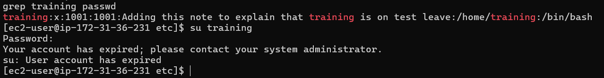

# Red Hat User Administration

## Objective

The objective of this project is to practice basic user administration on a Red Hat Enterprise Linux (RHEL) server.

In this project, I will:
- Explain a User
- Create multiple local users
- Assign passwords to each user
- Verify that the users were created successfully
- Practice basic Linux user management commands

## - User
 - A user account is used to provide security boundaries between different people and programs that can run commands.

 - They are three main types of user account: The super user, System user and Regular user.

 - Super User: account is for administration of the system, the name superuser is "root" and has an account UID 0
 - System user: this account are used by processes that provide supporting services. These processes or daemons usually do not need to run as the superuser.

 - Regular user- Linux users have this type of user account. the use for regular day to day work, like system users, regular users have limited access to the system.

 
 - Following are some adduser common switches −

## Switch	Action
- c	Adds comment to the user account
- m	Creates user home directory in default location, if nonexistent
- g	Default group to assign the user
- n	Does not create a private group for the user, usually a group with username
- M	Does not create a home directory
- s	Default shell other than /bin/bash
- u	Specifies UID (otherwise assigned by the system)
- G	Additional groups to assign the user to

## How to create users

The following user will be created:

<<<<<<< HEAD
- training

---

##### User (training)

- Create users by using the useradd command >> useradd training -c "training is a user in Marketing Department" 
=======
- Training

---

##### User (Training)

- Create users by using the useradd command >> useradd Training -c "training is a user in Marketing Department" 
>>>>>>> cbe2423b186bfda94f994d14073200ee82271370

- assign password to the new user "training" >> sudo passwd training

Use the `useradd` command to create the user:
Use the `passwd` command to create a password for the user you've created 
Use the `userdel` command to delete a user.

- To view the user we have created and check more information about user ID (UID) or user assigned group. you can use the 'id' or 'grep'command.

- id training - shows user info
- grep training /etc/passwd - return user information.

## Disabling User Account.

You can diable user account by editing the passwd file or using the passwd command.

- let's use the chage command, changing the expiry date of the user to a previous date. Also, it may be good to make a note on the account as to why we disabled it.

- let's disable this user 'training' using chage command.
- chage -E 2025-01-09 training 

- use the 'usermod' command to add note to the user profile 
- sudo usermod -E "Adding this note to explain that training is on leave"

- Use 'man' command to get more info on commands to get more information.
